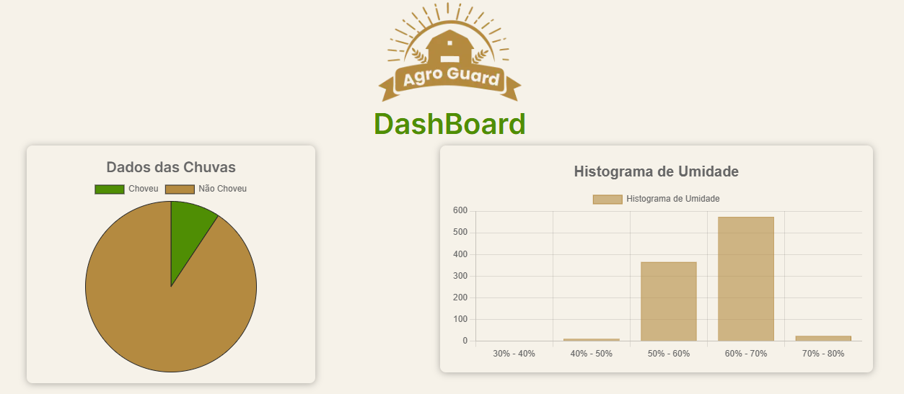
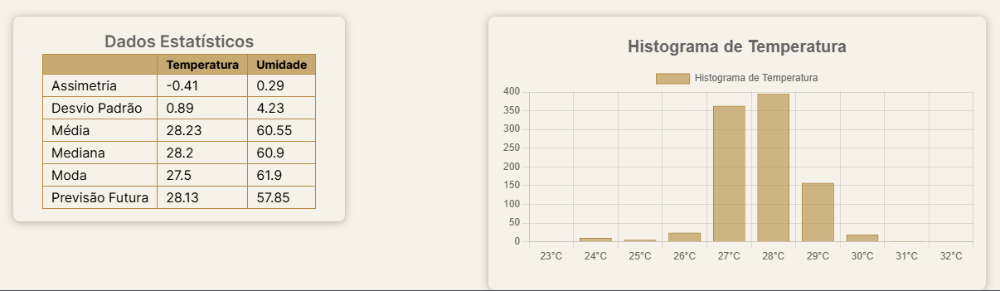

# Dashboard - Agro Guard
### Aplicação cujo objetivo é auxiliar os produtores na sua plantação, disponibilizando dados da temperatura e umidade.

## Objetivo
<p> Esse repositório concentra todas as informações do front-end que exibe a dashboard do projeto</p>

## Tecnologias
<p> - Next.js </br>
    - TypeScript </br>
    - TailWind </br>
    - Utilização de cache
</p>

## Imagens
</br>
</br>

## Teste o projeto
``` bash
# Clone este repositório
$ git clone <https://github.com/LucasTKP/dashboard-pi-quarto-semestre/>

# Acesse a pasta do projeto no terminal/cmd
$ cd dashboard-pi-quarto-semestre

# Instale as dependências
$ npm install

# Execute a aplicação 
$ next dev

# O servidor inciará na porta:3000 - acesse <http://localhost:3000>
```

## Deploy
<p>O site está hospedado na Vercel e está disponível no link:</p>
<p><a href="https://dashboard-pi-quarto-semestre.vercel.app/">Link Dashboard</a></br></p>

## Desenvolvido
<p>Todo o projeto foi desenvolvido pelos alunos: </br></p>
<p>Cayk Andrade Magnani,</br>Guilherme de Carvalho Ferreira e</br> Lucas Gean dos Santos.</p>
